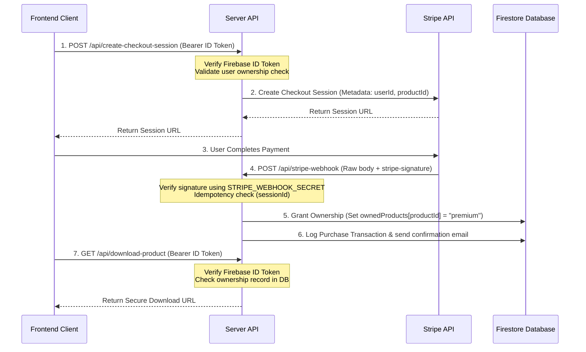

# Payment & Checkout Security Architecture

This document outlines the secure payment architecture, webhook verification, and digital delivery flow implemented in this application.

## Intended Secure Flow

To ensure digital product assets cannot be downloaded or accessed without a completed transaction, the application enforces the following pipeline:

---

## Security Controls

### 1. Cryptographic Signature Verification
All inbound Stripe webhooks to `/api/stripe-webhook` must have a valid `stripe-signature` header. The payload is verified using the raw request buffer and `STRIPE_WEBHOOK_SECRET` via Stripe SDK `stripe.webhooks.constructEvent()`. This prevents parameter tampering and spoofing.

### 2. Double-Sided Fulfillment Verification
- **Primary (Asynchronous Webhook)**: The `/api/stripe-webhook` serves as the primary authority for transaction logging, emailing, and ownership updates. If a client closes the browser or loses connection, the webhook guarantees fulfillment.
- **Secondary (Client-Side Verification)**: The success redirect page triggers `/api/verify-checkout-session` as a fallback for instant sync. 
  - To prevent spoofing, `/api/verify-checkout-session` requires the user's Firebase ID token.
  - The server retrieves the session directly from Stripe's servers using the `sessionId` and asserts that `session.metadata.userId` matches the authenticated caller's token UID.

### 3. Server-Side Price & Product Verification
All product prices, price IDs, and details are resolved on the server-side from Firestore. The client cannot inject a customized price or alter the payable amount during checkout creation. 

### 4. Stripe Key Segregation
Secret Stripe keys (`STRIPE_SECRET_KEY` and `STRIPE_WEBHOOK_SECRET`) are never exposed to the client bundle. They are loaded exclusively from server environment variables and are excluded from git.
