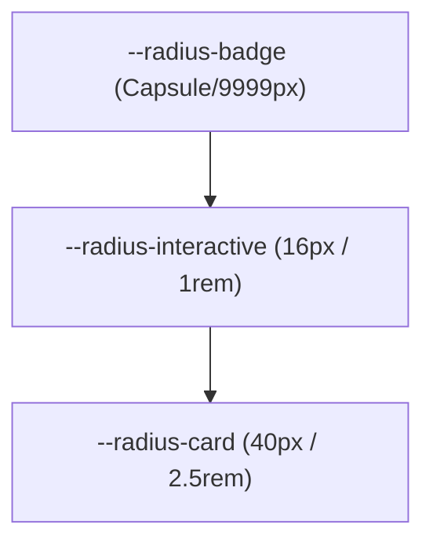

# Antigravity Design System Manual

Welcome to the **Antigravity Visual Architecture Manual**. This document serves as the single source of truth for the visual, typographic, structural, and motion foundations of the Antigravity digital ecosystem.

The Antigravity design system is built to balance a futuristic visual personality with the extreme precision and polish of modern elite platforms (such as **Apple**, **Linear**, and **Vercel**). This system is structured, predictable, and fully systemized using a hierarchy of Tailwind CSS v4 variables and standardized React primitives.

---

## 1. Visual & Design Philosophy

Antigravity is designed around three core visual pillars:
1. **Apple-Level Intentionality**: Layouts possess ample breathing room, organic rhythm, and absolute clarity of function. Every visual choice must serve usability.
2. **Linear-Style Precision**: Micro-borders, crisp typography ratios, sub-pixel alignments, and subtle contrast boundaries define card architectures and inputs.
3. **Vercel-Style Polish**: Blazingly fast micro-animations, glass backdrops, highly optimized typography layouts, and controlled glowing accent elements that guide the user rather than distract.

> [!IMPORTANT]
> **No Futuristic Neon Chaos**: Antigravity is a sophisticated innovator platform, not a gaming dashboard. Neon glows, gradients, and shadows must remain strictly bound to interactive accents and state transitions. Standard surfaces should always default to ultra-dark, high-contrast readability.

---

## 2. Global Design Tokens (Foundations)

Standard CSS tokens are centralized in [src/index.css](../src/index.css) to ensure absolute structural consistency. Avoid hardcoded values in local stylesheets or inline component definitions.

### A. Layout & Space Scale (8pt Grid System)
All padding, margin, gaps, and widths must conform to the strict 8pt grid scale:

| CSS Variable | Value | Equivalent | Usage Guidance |
| :--- | :--- | :--- | :--- |
| `--space-1` | `0.25rem` | `4px` | Micro-spacers, icon-to-text offsets |
| `--space-2` | `0.5rem` | `8px` | Badge paddings, close proximity items |
| `--space-3` | `0.75rem` | `12px` | Internal metadata group gaps |
| `--space-4` | `1rem` | `16px` | Interactive list items gaps, card item margins |
| `--space-6` | `1.5rem` | `24px` | Standard mobile paddings, grid gap-y |
| `--space-8` | `2rem` | `32px` | Core desktop card padding, standard grid gap-x |
| `--space-12` | `3rem` | `48px` | Sub-section spacing, nested containers |
| `--space-16` | `4rem` | `64px` | Base section separators, page hero offsets |
| `--space-24` | `6rem` | `96px` | Standard section top/bottom padding (Desktop) |
| `--space-32` | `8rem` | `128px` | Hero section top/bottom padding (Desktop) |

### B. Geometry & Radius Scale
All rounded borders use standard radius tokens to preserve consistent shape transitions:



*   `--radius-interactive` (`1rem` / `16px`): Enforces smooth curvature on high-frequency interaction points like inputs, form elements, buttons, and popups.
*   `--radius-card` (`2.5rem` / `40px`): Used for visual containers (`ProductCard`, `LabCard`, `EcosystemCard`, `ComposeNewsletterModal`). This generous radius provides a premium, custom hardware-like frame.
*   `--radius-badge` (`9999px`): Standard capsule configuration for functional tags, status badges, and social tickers.

---

## 3. Typography System & Hierarchy

Antigravity implements responsive typographic systems powered by modern CSS fluid clamping (`clamp()`) and strict semantic roles.

### A. Core Fonts
*   **Sans-Serif (Body & UI)**: [Inter](https://fonts.google.com/specimen/Inter) — Configured with advanced open-type ligature features (`"cv02", "cv03", "cv04", "cv11"`) for ultimate digital legibility.
*   **Display (Headings)**: [Outfit](https://fonts.google.com/specimen/Outfit) — Bold geometric structure with high cap-height, optimized for tight tracking and premium editorial impact.
*   **Monospace (Code & Tech)**: [JetBrains Mono](https://fonts.google.com/specimen/JetBrains+Mono) — Used for code segments, technical metadata, and key status tickers.

### B. Fluid Typography Scale
Titles automatically clamp their font sizes dynamically based on screen real estate, eliminating abrupt layout shifts at mobile breakpoints:

*   **H1 (Page Titles)**: `@apply text-[clamp(2.5rem,8vw,5.5rem)] font-extrabold tracking-tighter;`
    *   *Line-height*: `1` (tightly locked to avoid trailing line clipping).
*   **H2 (Section Titles)**: `@apply text-[clamp(2rem,6vw,4rem)] font-bold tracking-tighter;`
*   **H3 (Card & Sub-headings)**: `@apply text-[clamp(1.5rem,4vw,3rem)] font-bold tracking-tighter;`
*   **Body Copy**: `@apply text-base font-medium leading-relaxed;` (default color at `rgba(255, 255, 255, 0.4)` for deep background contrast hierarchy).

---

## 4. Glassmorphism & Surface Taxonomy

The background framework represents a layered depth architecture. Elements appear on top of each other using physical transparency layers (`rgba()`) rather than flat, synthetic gray blocks.

```
┌────────────────────────────────────────────────────────┐
│  Layer 3: Interactive Badges & Dropdowns               │
│  - bg: rgba(255, 255, 255, 0.08)                       │
│  - border: 1px solid rgba(255, 255, 255, 0.15)         │
├────────────────────────────────────────────────────────┤
│  Layer 2: Standard Cards & Containers                  │
│  - bg: rgba(255, 255, 255, 0.015)                      │
│  - border: 1px solid rgba(255, 255, 255, 0.04)         │
├────────────────────────────────────────────────────────┤
│  Layer 1: Dark Canvas (Base Background)                │
│  - bg: #0A0A0A                                         │
└────────────────────────────────────────────────────────┘
```

### A. Semantic Surface Tokens
```css
--glass-bg-primary: rgba(255, 255, 255, 0.015);
--glass-bg-hover: rgba(255, 255, 255, 0.035);
--glass-border-low: rgba(255, 255, 255, 0.04);
--glass-border-mid: rgba(255, 255, 255, 0.08);
--glass-border-high: rgba(255, 255, 255, 0.12);
--glass-blur-premium: blur(32px);
```

### B. Standardized Card Utilities
*   `.glass`: The base blur background utility. Mapped with `--glass-bg-primary`, `--glass-blur-premium`, and `--glass-border-low` (1px solid micro-border).
*   `.glass-card`: Core wrapper combining `.glass` with `--radius-card` (40px) and standard spring transitions.
*   `.glass-card-hover`: Dynamic interactive state. When hovered, the card lifts seamlessly (`translateY(-5px) scale(1.005)`), darkens the background layer (`--glass-bg-hover`), brightens the micro-border to `--glass-border-mid`, and projects a rich dark-ambient drop shadow with a micro-glow coordinate overlay:
    ```css
    box-shadow: 0 24px 48px -12px rgba(0, 0, 0, 0.5), 0 0 40px rgba(0, 194, 255, 0.02);
    ```

---

## 5. Spaced & Controlled Glow System

Glow parameters must never saturate readable blocks. A high-premium dark mode relies on controlled visual guidance.

### A. Glow Weights & Intensities
Glow filters project standard color codes configured via RGB variables for seamless opacity control:
*   **Cyan (Primary Brand Indicator)**: `rgb(var(--neon-primary))` $\rightarrow$ `0, 194, 255`
*   **Red (Secondary Threat/Scarcity Accent)**: `rgb(var(--neon-secondary))` $\rightarrow$ `255, 0, 60`
*   **Purple (Venture Innovation/Alpha Accent)**: `rgb(var(--neon-accent))` $\rightarrow$ `123, 97, 255`

### B. Contrast Bounds & Opacity Limits
*   **Background Orbs**: Opacities must never exceed `0.25` for background glows, and they must carry a high Gaussian blur (`filter: blur(140px)`) to preserve typographic contrast ratios above `4.5:1` as mandated by WCAG AA guidelines.
*   **Text Glows**: Inline typographic glows (`.neon-glow-blue` or `.neon-glow-red`) should only be applied to headers of size `H2` or larger, or to distinct active badge statuses.
*   **Hover Glows**: Border glows should keep their container drop-shadow opacity bounded to a maximum of `0.05` to prevent neon saturation.

---

## 6. Motion System & Interactive Physics

Motion in Antigravity is cinematic and natural. It is governed by a unified system of custom cubic-bezier curves and spring constraints.

### A. Physics-Engine Specifications
Standard interactive physics values are centralized inside [src/lib/motion-presets.ts](../src/lib/motion-presets.ts):

*   **`EASING.PREMIUM`** (`[0.16, 1, 0.3, 1]`): This custom cubic-bezier curve provides a highly weighted acceleration profile followed by a long, elegant deceleration tail. Perfect for page transitions, drawer disclosures, and card reveals.
*   **`EASING.BOUNCE`** (`[0.34, 1.56, 0.64, 1]`): A snappy, organic spring that generates a tiny overshoot on interaction. Perfect for status indicators, active tabs, and badges.
*   **`EASING.SPRING_INTERACTIVE`** (`{ type: "spring", stiffness: 300, damping: 30, mass: 0.8 }`): Our custom physics preset for responsive cursor interactions, magnetic buttons, and visual clicks.

### B. Standard Reveal Sequences
All content lists (blog rolls, lab files, product showcases) must stagger their entries sequentially:
*   **Stagger Duration Interval**: `0.05s` delay between child layers (`VARIANTS.staggerContainer`).
*   **Individual Reveal Animation**: `VARIANTS.fadeUp` triggers a smooth, premium translation alongside an organic focus adjustment:
    *   *Initial state*: `opacity: 0; y: 20px; filter: blur(8px)`
    *   *Animated state*: `opacity: 1; y: 0; filter: blur(0px)`
    *   *Transition*: `duration: 0.4s` utilizing `EASING.PREMIUM`

---

## 7. Component Taxonomy & Standards

To protect visual alignment, follow these strict constraints when constructing or modifying UI primitives:

### A. Core CTA Buttons (`button.tsx`)
Buttons implement structural variances configured cleanly under `class-variance-authority`:
*   `variant: "default"`: Solid white canvas with pitch-black text. Projects high-contrast prominence. On hover, it expands slightly (`scale-[1.02]`) and presses down on click (`scale-[0.98]`).
*   `variant: "secondary"`: Translucent background (`white/5`) with a thin boundary (`white/5`) and low-opacity text (`white/60`). Designed to recede gracefully in visual priority.
*   `variant: "outline"`: Clean glass frame (`border-white/10`). Enhances readability by darkening backdrop hover surfaces (`white/5`).
*   `variant: "premium"`: Default solid base accompanied by a subtle ambient box-shadow glow.

### B. Core Cards (`ProductCard`, `LabCard`, `EcosystemCard`)
All visual cards must adhere strictly to identical layout boundaries:
1.  **Padding Rhythm**: Desktop card wrapper must utilize `p-8` (32px padding). Mobile must adjust responsively to `p-6` (24px padding).
2.  **Interactive Lift**: Hover animations must strictly limit translation lift to `-5px` and scale adjustments to `1.005`. Aggressive movements look amateurish.
3.  **Title Lock**: Content titles should occupy exactly `h3` structures (`text-2xl`), capped to a clean double-line limit (`line-clamp-2`) to avoid visual misalignment in side-by-side grids.

### C. Standard Layout Grids & Sections
All components are wrapped inside structured layouts to preserve horizontal margins:
*   `.layout-section`: A robust structural section that wraps elements globally, providing normalized vertical spacing via `--layout-section-py` (6rem/96px on desktop, scaling dynamically down to 4rem/64px on mobile).
*   `.layout-container`: Standard horizontal alignment block centered on screen using a max-width limit of `--layout-max-width` (1440px) and padding `--layout-container-px`.
*   `.layout-grid`: Responsive grid template implementing our **12-8-4 Grid Standard**:
    *   *Desktop (min-width: 1024px)*: 12-column grid.
    *   *Tablet (min-width: 768px)*: 8-column grid.
    *   *Mobile*: 4-column grid.
    *   *Gap System*: Always defaults to `gap: 2rem` (32px) to provide elegant separation.

---

## 8. Accessibility & Semantics Checklist

Visual brilliance must never compromise functional inclusivity. Ensure every new interface component passes these criteria:

1.  **Semantic Elements**: Never replace native elements with raw divs unless absolutely required for complex custom visualizations. Buttons must utilize `<button>`, content areas must utilize `<article>` or `<section>`, and titles must utilize ordered tags (`h1`, `h2`, `h3`).
2.  **Unique DOM Identifiers**: All interactive components (input fields, submission buttons, modals, toggle switches) must carry a unique, descriptive `id` attribute. This protects assistive screen readers and ensures robust test-runner stability:
    ```html
    <button id="cta-waitlist-submit" class="...">Join Waitlist</button>
    ```
3.  **Typographic Spacing**: Ensure all paragraphs, descriptions, and blocks use layout wrap safety classes (`.wrap-safe` or word break properties) to prevent truncation or horizontal overflows on narrow displays.
4.  **Contrast Minimums**: Background glows, spotlight overlays, and gradient animations must not drop body text contrast below the **4.5:1 ratio**. If light glows are present, darken the overlay surface background.

---

*This design system manual is the architectural anchor of the Antigravity digital ecosystem. Keep visual parameters strict, preserve natural motion curves, and prioritize precision in every change.*
